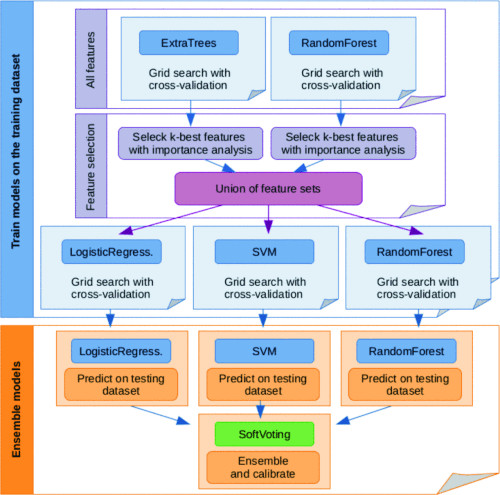

# PSS-ML
Machine learning for the power system transient stability analysis

Ensemble learning, using a voting classifier, for the electrical power system transient stability analysis. Model is built using the `scikit-learn` Python library. Dataset has been produced from the numerical simulations of the IEEE New England benchmark test case, using the MATLAB Simulink environment and statistically post-processed for extracting appropriate features. This repository serves as an accompanying code-base for a conference paper.

Jupyter Notebook rendered on nbviewer: [PSS-ML](https://nbviewer.org/github/sarajcev/PSS-ML/blob/master/PSStabML.ipynb)

A. Kunac and P. Sarajcev, "Ensemble Learning Approach to Power System Transient Stability Assessment," 2020 5th International Conference on Smart and Sustainable Technologies (SpliTech), 2020, pp. 1-6, doi: [10.23919/SpliTech49282.2020.9243849](https://ieeexplore.ieee.org/document/9243849).
